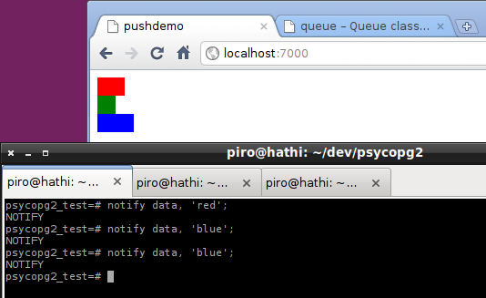

======================================
*Psycopg*: Python for PostgreSQL users
======================================

.. class:: text-right

    PGDay UK 2013

    Daniele Varrazzo

----

Do you know Python?
===================

That funny little language where white spaces matter

..
    Note to piro: you want
    :autocmd BufWritePost psycopg.rst :silent !make html

Presenter notes
---------------

You know python, that funny language that syntax errors on you when you get
the spaces wrong? I tried to talk a friend of mine out of .NET using Python
and he thought about that for a few seconds and he said ...like FORTRAN? He
said this way, in uppercase.

----

"like FORTRAN?!"
================

----

Python in the 10's
==================

- Software development: PHP -> Python

  (path similar to MySQL -> PostgreSQL)

- System development: Perl -> Python

Presenter notes
---------------

Anyway, time has passed and Python has became a staple piece of technology in
every \*nix based shop, with a lot of migration from older technologies. People
moves from PHP to Python looking for a more sane environment pretty much as
MySQL people start using Postgres when they grow up.

So, what's for us? I'll dress myself as a PostgreSQL user with just a working
knowledge of Python and see what I can do.

----

Python and PostgreSQL
=====================

- What's *not* the difference?

  - numbers
  - strings
  - dates
  - ...

- Both strongly typed

- Both rich in data types

- Both easily extendible

Presenter notes
---------------

First non-difference:

- PostgreSQL has a very expressive objects model
- Python has a very expressive objects model

That's cool, they know numbers, we know numbers; they know dates, we know
dates...

Actually, it's just too cool: as a DB designer I know that pretty much the
application's language is capable to follow the data model I have designed
(the idea being that the data is more precious than the code and will survive
longer).

----

Psycopg: *it gets out of the way*
=================================

- Read Python objects from SQL queries
- Write Postgres types as query parameters

Presenter notes
---------------

That's why one of Psycopg goal is: to get out of the way. To phrase it better:
what we want from it is to make use of Python's rich data type when it's up to
reading from PostgreSQL and the other way around (to use the PostgreSQL rich
data model when storing Python objects).

----

What is ``psycopg2``?
=====================

- A database *driver*
- *The most used* Python driver
- `Good docs`__
- Comprehensive test suite

.. __: http://initd.org/psycopg/docs/

Presenter notes
---------------

Psycopg is a "driver". It is fairly low in any well over-engineered babel
tower you want to abstract your problems under. The good part is it's high
level enough to be used on itself, even if it's always possible to build some
"higher intelligence" on top of it, such as ORM.

Another relevant attribute of Psycopg is that it's pretty much a standard:
saying it's "the most used Python driver" is an understatement: because a
relatively dark period in Psycopg development life (2008-2010 circa) there
have been a lot of drivers being developed (pg8000 is iconic in that as it's
named that way because "it must be the 8000th Postgres driver implemented").
This is no more the case: by accurate scientific method (raise of hands in
PyCon 2012) I can say no other Python driver is in relevant use.

So, that's cool, Psycopg is a sort of standard. You can expect to find it
wherever Python and Postgres exist (I was surprised finding into the NAS I
have in a closet at home).

----

What is ``psycopg2`` made of?
=============================

- ``libpq`` wrapper

- Mostly implemented in C

  (good for CPython - 95% of users (stat just made up))

- A `pure Python implementation`__ using FFI exists

  (for CPython, PyPy. Maybe Jython, IronPython too?)

.. __: https://pypi.python.org/pypi/psycopg2cffi

Presenter notes
---------------

Other statement about Psycopg: "it's a libpq wrapper written in C"

The first part is by design; The second is an implementation detail
(alternative implementation exist).

So, you'd use the C implementation of psycopg2 if you are using cpython (e.g.
when you don't know what you are using) and you can use a pure implementation
in alternative, non c-based Python implementation (e.g. Jithon, IronPython,
PyPy).

Alternative implementation have to pass psycopg2 test suite to declare
themselves psycopg-something, so the behaviour is pretty uniform (or it's a
bug that gets a new test case in the next release).

----

What does ``psycopg2`` look like?
=================================

Implements the `DBAPI 2.0`__

.. __: http://www.python.org/dev/peps/pep-0249/

- Good: it's a standard

- Bad: not the greatest standard

- Main entry points: ``connect()`` function, ``connection``, ``cursor``
  classes

Presenter notes
---------------

Another statement on psycopg:

"it's a DBAPI implementation"

DBAPI is the standard way to implement a database driver in Python: Psycopg
model is desinged to follow that standard and a few quirky choices can be
traced to that (autocommit, we'll see). Don't have much to say about that,
except that the API is fully respected so it could be an extra box we can put
a tick in.

----

Example: basic usage
====================

.. code-block:: python

    >>> import psycopg2
    >>> conn = psycopg2.connect("dbname=test user=postgres")
    >>> cur = conn.cursor()

    >>> cur.execute("""
            CREATE TABLE test (
                id serial PRIMARY KEY,
                num integer, data varchar)
            """)

    >>> cur.execute("INSERT INTO test (num, data) VALUES (%s, %s)",
    ...      (100, "abc'def"))

    >>> cur.execute("SELECT * FROM test")
    >>> cur.fetchone()
    (1, 100, "abc'def")

    >>> conn.commit()

    >>> cur.close()
    >>> conn.close()

----

The ``connection`` class
========================

``conn = psycopg2.connect(conninfo)``

- Wraps a database connection

- Controls transactions

- Creates ``cursor``\ s

Presenter notes
---------------

Anyway, let's cut the babbling and get to the point: COOOODE!!!

Psycopg revolves around two objects:

- the connection
- the cursor

The connection wraps a PostgreSQL connection, so for instance the state to be
"in transaction" or "in error" is the connection's.

----

The ``cursor`` class
====================

.. code-block:: python

    cur = conn.cursor()

- Issues statements

- Holds a result

Server-side__ cursors
=====================

.. code-block:: python

    cur = cnn.cursor("some name")

- Real PostgreSQL cursor (DECLARE__)

- Incremental fetch from the server

.. __: http://initd.org/psycopg/docs/usage.html#server-side-cursors
.. __: http://www.postgresql.org/docs/current/static/sql-declare.html

Presenter notes
---------------

The cursors is normally not a PostgreSQL objects. Cursors represent you, your
two small children and your cat all banging on a keyboard with a psql shell
and want to execute a command: in order to respect everybody's sanity the
operations on the same connection are serialized and, if a transaction is
started, all the cursors work in the same transaction. Apart from that, what a
cursor does is to keep a result. So it's cheap and easy to create two cursor
and iterate on the first cursor's result to do operation with the second
cursor, all in the same transaction.

Normal cursors are purely client-side structures: the query result is
transferred entirely from the server to the client before it is returned to
Python. If this is undesirable it's possible to use "server-side cursors", the
ones created by the PostgreSQL CURSOR statement.

Same interface, slightly different life cycle (cannot be reused)

----

Fetching data
=============

.. code-block:: python

    cur.fetchone()      # returns one tuples
    cur.fetchmany(n)    # returns a list of n tuples
    cur.fetchall()      # returns a list with all the tuples
    for t in cur:
        pass            # iterable of tuples

Unpacking:

.. code-block:: python

    for title, date, body in cur:
        pass

`Named tuples <http://initd.org/psycopg/docs/extras.html#namedtuple-cursor>`__:

.. code-block:: python

    cur = conn.cursor(cursor_factory=NamedTupleCursor)
    # ...
    for r in cur:
        r.title, r.date, r.body

Presenter notes
---------------

What do we get back from the database?

Tuples!

::

    cur.fetchone()      -> one tuples
    cur.fetchmany(n)    -> n tuples
    cur.fetchall()      -> all the tuples
    for t in cur:
        ...             -> tuples in a sequence

Regular tuples are indexed with a numeric 0-based index. They can be unpacked
in the language to enable stuff like::

    for title, date, body in cur:
        ...

Cursor subclasses allow different style of access. Named tuples are useful::

    for r in cur:
        r.title, r.date, r.body ...

there are dict-returning cursors too, and it's easy to write new ones
(subclassing).

----

Example: multiple cursors
=========================

.. code-block:: python

    def work(cnn):
        cur = cnn.cursor()
        cur.execute(BIG_FAT_QUERY)
        for r in cur:
            do_something(cnn, r)

        cnn.commit()

    def do_something(cnn, r):
        cur = cnn.cursor()
        cur.execute(SOME_QUERY, args(r))

Presenter notes
---------------

Typical function pattern: get a connection as argument, do your job in a
separate cursor and don't commit it: the function can be composed with other
functions and a single super-function can be responsible of committing. Any
error in any function would roll-back all everything in the connection's
transaction.

----

Connections and transactions
============================

1. "the transaction belongs to the ``connection``"

2. "every statement must begin a transaction" (per DBAPI)

3. trouble::

    <IDLE> in transaction

Presenter notes
---------------

One thing we said: "the transaction belongs to the connection", and we have
seen that several cursors can be created on a transaction. Compounded with the
DBAPI requirement that "every statement must begin a transaction" here we have
a tricky problem.

----

Connections and transactions
============================

- Psycopg antipattern: run a query and forget about it

  .. code-block:: python

    cnn = psycopg2.connect(DSN)
    cur = cnn.cursor()
    cur.execute("select now()")

- A transaction has now started and nobody cares to terminate it

Presenter notes
---------------

If the program doesn't terminate now, the "execute()" has started a
transaction and, if the connection cnn is not closed (or committed or rolled
back) the session stays on.

----

Pro Tip #1: Idle in transaction
===============================

- Diagnosis:

  .. code-block:: psql

      =# select * from pg_stat_activity where current_query ~ '<IDLE> in';

- Solution:

  .. code-block:: python

        with psycopg2.connect(DSN) as cnn:
            with cnn.cursor() as cur:
                do_someting(cur)

            with cnn.cursor() as another_cur:
                do_somethingelse(another_cur)

        with cnn:
            keep_on_using(cnn)

- Alternative:

  .. code-block:: python

    cnn.autocommit = True

Presenter notes
---------------

Pro tip #1: if you have just started a job in a Python-PostgreSQL shop, have a
"select * from pg_stat_activity where current_query ~ '<IDLE> in';" and go
around chasing the rogue scripts holding your tuples in the past.

- cursors are properly closed (doesn't really matter for client-side cursor,
  but it's a big deal with server-side ones)

- connections are not closed, but the transaction committed (if the with block
  ends without errors) or rolled back (if the with exits with an exception).

----

Data adaptation
===============

Talking to PG:

.. code-block:: python

    def get_articles_before(d):
        d = datetime.strptime(d, '%d/%m/%Y')
        cur.execute("""
            select title, date, body from article
            where date < %s
            order by date desc, id desc
            limit 10""",
            [d])

- Python converts from boundary syntax to object

- Psycopg converts the Python object to PostgreSQL syntax

Presenter notes
---------------

Here the date is parsed with some Python-specific method and a Python date is
obtained. If the date is something that "can be adapted", then just passing to
the query will do everything right:

- correct conversion in a string format
- correct quoting.

----

Pro Tip #2: security is a mindset
=================================

You can write crappy code with Psycopg too, but it takes effort

- **Q.** how to write safe code with **$BAD_DRIVER**?
- **A.** remember to wrap every parameter through some ``sanitize()`` function

- **Q.** how to write *unsafe* code with Psycopg?
- **A.** ignore all the features and do "by hand"

.. code-block:: python

    cur.execute("select * from blah where key = '" + key + "'") # BAD
    cur.execute("select * from blah where key = %s", [key]))    # GOOD

- *Little Bobby Tables* is fundamentally wrong

Presenter notes
---------------

What to do if your developer writes code in the second style? Don't shout at
him, don't break his heart: he has only one. Break him a bone: he's got 206.

Bottom line: psycopg makes hard to mess up with security. It's still possible
but it must be a voluntary act of self-harm: psycopg used in a straightforward
way offer a safe support to avoid SQL injections.

----

Data!
=====

Default data types mapping: no surprise here

.. table::
    :class: data-types

    +--------------------+-------------------------+
    | Python             | PostgreSQL              |
    +====================+=========================+
    | ``None``           | ``NULL``                |
    +--------------------+-------------------------+
    | ``bool``           | ``bool``                |
    +--------------------+-------------------------+
    | ``int``,           | ``smallint``,           |
    | ``long``           | ``integer``,            |
    |                    | ``bigint``              |
    +--------------------+-------------------------+
    | ``float``          | ``real``,               |
    |                    | ``double``              |
    +--------------------+-------------------------+
    | ``Decimal``        | ``numeric``             |
    +--------------------+-------------------------+
    | ``str``,           | ``varchar``,            |
    | ``unicode``        | ``text``                |
    +--------------------+-------------------------+
    | ``date``           | ``date``                |
    +--------------------+-------------------------+
    | ``time``           | ``time``                |
    +--------------------+-------------------------+
    | ``datetime``       | ``timestamp``,          |
    |                    | ``timestamptz``         |
    +--------------------+-------------------------+
    | ``timedelta``      | ``interval``            |
    +--------------------+-------------------------+

Presenter notes
---------------

Let's talk about data! That's what really matter

So, why is psycopg cool? Because it works as expected:

PG strings <-> Python strings (or unicode, better)
PG numbers <-> Python numbers (int, floats, Decimal)
PG date/time <-> Python date/time objects (the model is the same: date, time, datetime, interval [timedelta]). Timezones just work.

----

More Data!
==========

- ``list`` <-> ``ARRAY``

  .. code-block:: python

    >>> cur.execute("""select array_agg(d)::date[]
        from generate_series('2013-07-11'::date, '2013-07-12'::date,
            '1 day'::interval) s(d)""")
    # [datetime.date(2013, 7, 11), datetime.date(2013, 7, 12)]

- [``named``] ``tuple`` <-> composite

  .. code-block:: python

    >>> cur.execute("CREATE TYPE card AS (value int, suit text)")
    >>> psycopg2.extras.register_composite('card', cur)
    >>> cur.execute("select (8, 'hearts')::card")
    # card(value=8, suit='hearts')

- ``dict`` of ``str`` <-> ``hstore``

  .. code-block:: python

    >>> psycopg2.extras.register_hstore(cur)
    >>> cur.execute("select 'a => foo, b => NULL'::hstore")
    # {'a': 'foo', 'b': None}

----

Even More Data!
===============

From Psycopg 2.5

- Psycopg's ``Range`` <-> ``range``

  .. code-block:: python

    >>> cur.execute("select '[0,10)'::int8range")
    # NumericRange(0, 10, '[)')
    >>> r.upper_inc, r.lower_inc
    (False, True)

  - Builtin range types supported out-of-the-box
  - New range type supported by ``psycopg2.extras.register_range()``

- Anything™ <-> ``json``

  .. code-block:: python

    >>> cur.execute("insert into mytable (jsondata) values (%s)",
        [Json({'a': 100})])

----

Adaptation
==========

.. code-block:: python

    from xml.etree import cElementTree as ET
    from psycopg2.extensions import adapt, register_adapter

    class ElementAdapter:
        def __init__(self, elem):
            self.elem = elem
        def getquoted(self):
            return "%s::xml" % adapt(ET.tostring(self.elem))

    register_adapter(type(ET.Element('')), ElementAdapter)

    # usage
    elem = ET.fromstring("<doc>Hello, 'xml'!</doc>")
    cur.execute("INSERT INTO xmltest (xmldata) VALUES (%s)", [elem])

Presenter notes
---------------

Adaptation is by Python class: in order to customize it (converting a new or existing type to some piece of postgres syntax):

- create a wrapper for your object (taking an instance as input)
- give it a getquoted() method to return a valid SQL snippet
- map the wrapper to the class ('psycopg2.extensions.adapt(cls, adapter)')

----

Typecasting
===========

.. code-block:: python

    from psycopg2.extensions import new_type, register_type

    def cast_xml(value, cur):
        if value is None: return None
        return ET.fromstring(value)

    XML = new_type((142,), "XML", cast_xml)
    register_type(XML)

    # usage
    cur.execute("SELECT xmldata FROM xmltest")
    elem = cur.fetchone()[0]
    print elem.text     # Hello, 'xml'!

Presenter notes
---------------

    The mapping is oid, string -> typecaster(string) -> Python type.

    - create a typecaster object with a function taking a string
    - bind the typecaster to one or more oid
    - profit

    example: xml

----

Async notification
==================

.. code-block:: python

    def dblisten():
        conn = psycopg2.connect(DSN)
        conn.autocommit = True

        cur = conn.cursor()
        cur.execute('listen data')
        cur.close()

        while 1:
            wait_read(conn.fileno())    # cooperative select()
            conn.poll()
            while conn.notifies:
                n = conn.notifies.pop()
                print "received notify:", n.pid, n.channel, n.payload

----

Async notification demo
=======================

Using gevent__, gevent-websocket__, psycogreen__

.. __: http://www.gevent.org/
.. __: http://www.gelens.org/code/gevent-websocket/
.. __: https://bitbucket.org/dvarrazzo/psycogreen/

.. class:: apology

    This demo requires the ``pushdemo.py`` script running.

.. raw:: html

    
    
    
    
&nbsp;

    
&nbsp;

    
&nbsp;

    

.. class:: text-right

    Demo code at https://github.com/dvarrazzo/psycopg-pgdayuk-2013

----

Async notification demo (offline)
=================================

----

The future
==========

- Use ``libpq`` params

  - (yes, yes... but not backward compatible)

- Content (not quoted) adaptation

  - Would also improve ``COPY``, ``hstore``...

- Binary protocol, prepared statements...

----

Update path
===========

- New adaptation protocol

  - Optional in Psycopg 2.(*n*\+1), default in ``psycopg3``

- ``psycopg3`` would be a ``psycopg2`` wrapper with modern defaults

  - Es. Unicode everywhere by default

- Sponsorship required

  - Kickstarter project?

----

Thank you!
==========

----

Questions?
==========

